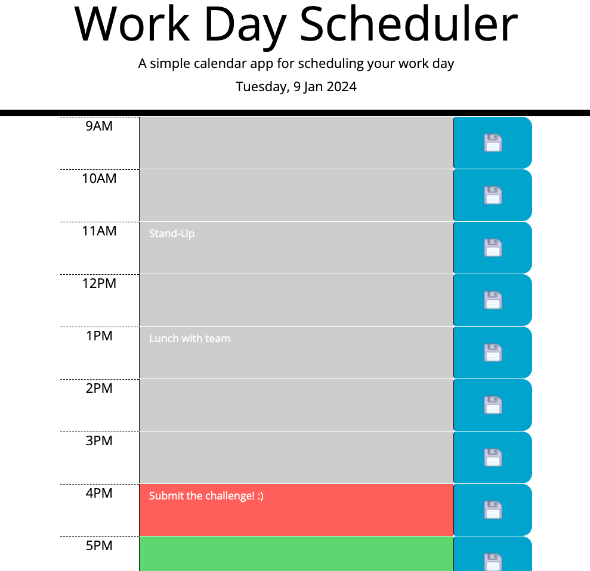

# Work-Day-Scheduler-Andrea-Melisa
Create a simple calendar application that allows a user to save events for each hour of the day.

## Description

This project is the challenge number seven from the bootcamp. In this case I need to create a simple calendar application that allows a user to save events for each hour of the day by modifying starter code. This app will run in the browser and feature dynamically updated HTML and CSS powered by jQuery.

We should use the [Day.js](https://day.js.org/docs/en/display/format) library to work with date and time.

## Acceptance Criteria

The app should:

* Display the current day at the top of the calender when a user opens the planner.
 
* Present time blocks for standard business hours when the user scrolls down.
 
* Color-code each time block based on past, present, and future when the time block is viewed.
 
* Allow a user to enter an event when they click a time block

* Save the event in local storage when the save button is clicked in that time block.

* Persist events between refreshes of a page.

## Table of Contents
- [Installation](#installation)
- [Usage](#usage)
- [Credits](#credits)
- [License](#license)

## Installation
N/A

## Usage
To use the application here you have the link to the deployed webpage: https://andrea-melisa.github.io/Work-Day-Scheduler-Andrea-Melisa/

Write a task in the middle section and click on the button with the disk.

If you refresh the page, your tasks should remain.

Here you have a screenshot from the web page:

## Credits

Thanks to the instructor Laura Cole and to the TA Martin William from EDX and to all other students from the bootcamp for sharing their knowledge.
And a big thank you to Marcos Z. as allways.

Sources:

https://api.jquery.com/

https://Day.js

https://developer.mozilla.org/en-US/docs/Web/API/Window/localStorage

Icon image:

https://icons8.com/icon/21394/save

## License
Please refer to the LICENSE in the repo.

## Badges
*HTML 57.9%

*JavaScript 27.3%

*CSS 14.8%

*JQUERY

